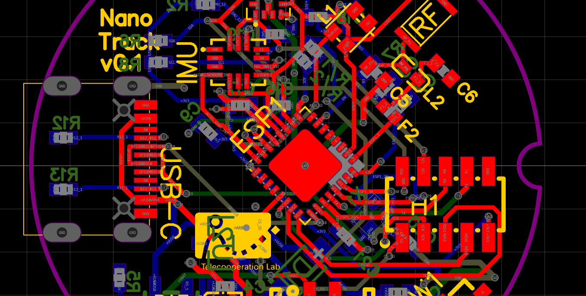
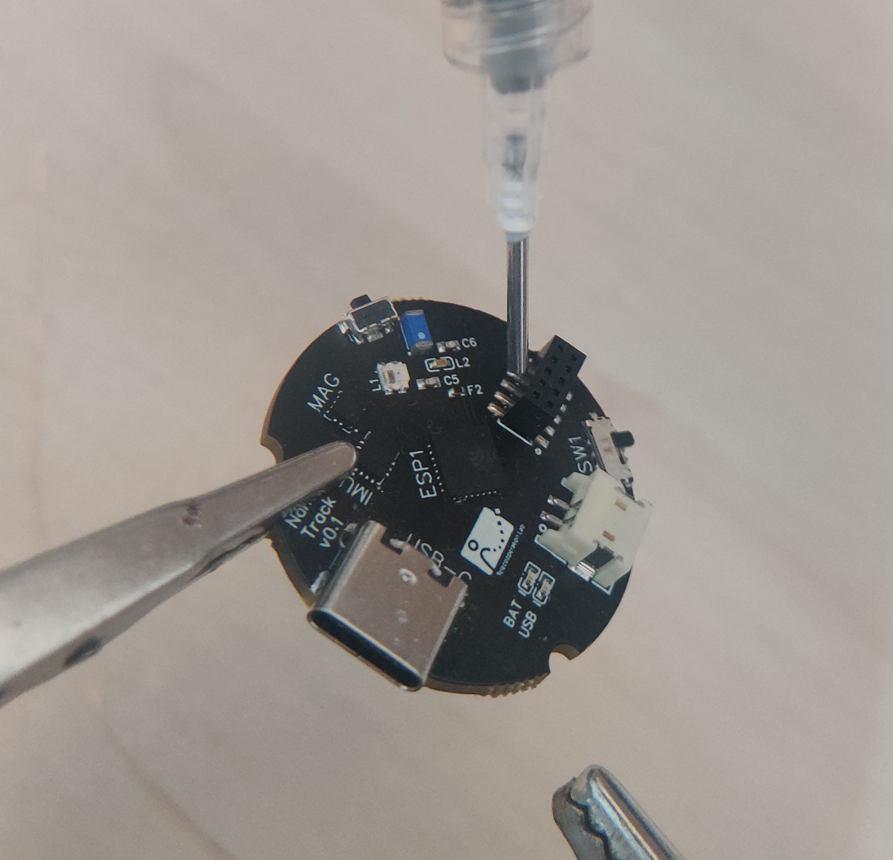
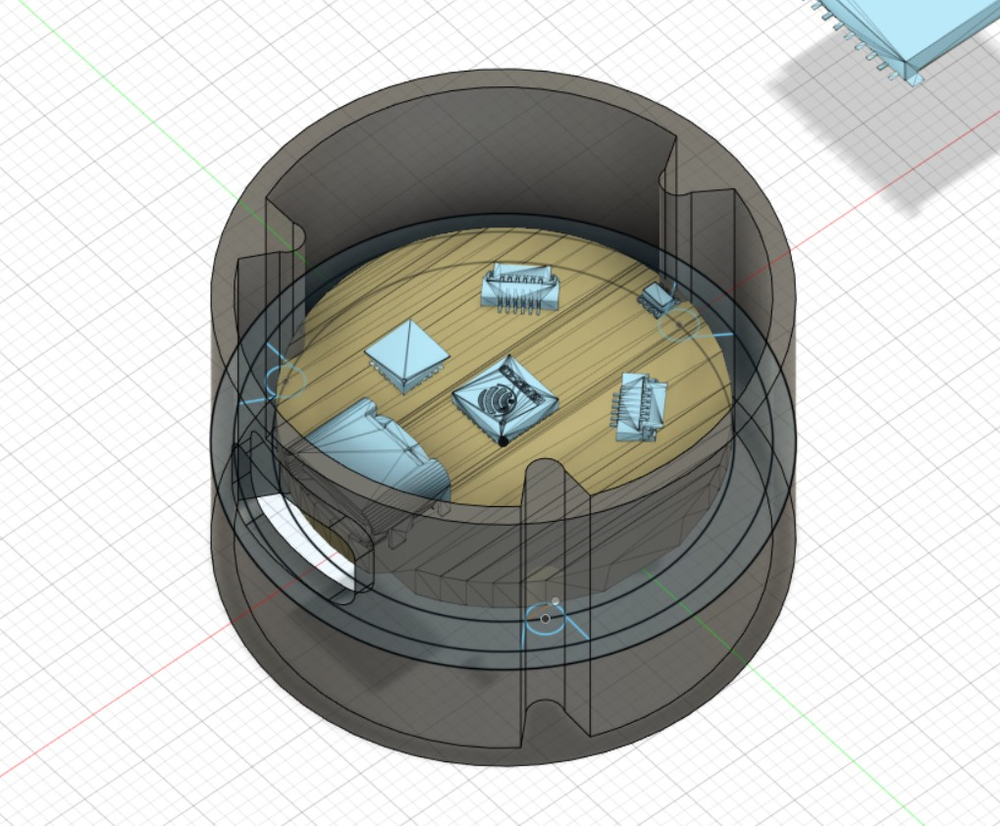
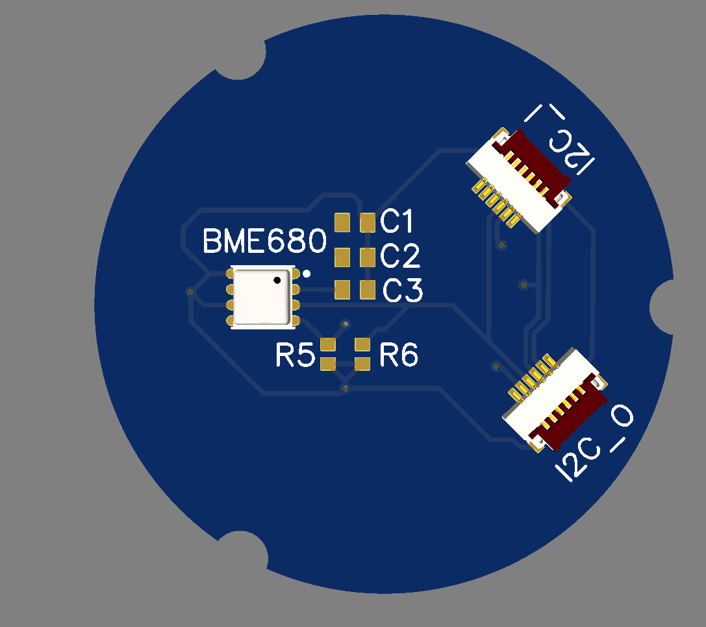

# NanoTrack v0.1: A Modular HCI Platform

The NanoTrack v0.1 is a versatile, small form-factor hardware platform for human-computer interaction (HCI) projects. Based on the ESP32-C3, it's designed for sensor data collection, actuator control, and direct device-to-device communication using ESP-NOW. Its modular design allows for easy expansion and customization.

## Hardware

### Specifications

- **Processor**: ESP32-C3 (single-core RISC-V @ 160MHz)
- **Sensors**: Integrated 6-axis IMU (MPU-6050) with accelerometer and gyroscope.
- **Connectivity**: Wi-Fi, ESP-NOW, USB-C (for charging and programming).
- **Features**:
    - RGB-LED for status indication.
    - Physical LiPo battery disconnect switch.
    - User-programmable button.
    - Onboard battery charging and protection circuit.

### Pinout

| Function | PIN | Mode |
| --- | --- | --- |
| MISO | 24 | SPI |
| MOSI | 23 | SPI |
| SCK | 22 | SPI |
| CS_SD | 21 | SPI |
| SDA | 14 | I2C |
| SCL | 15 | I2C |
| Button | 10 | Input |
| RGB LED  | 12 | Output |
| Battery Voltage | 9 | Input |
| Accel /Gyro Programmable Interrupt 1  | 16 | Input |
| Accel /Gyro Programmable Interrupt 2 | 13 | Input |

### Modularity: Board-to-Board Connector

The NanoTrack is intended to use pogo pins for its modular board-to-board connections, allowing for a pressure-fit connection between the main board and extension modules. This design supports SPI, I2C, and serial communication for plug-and-play functionality. In its current state it uses dupon pin header as connection interface. A version with flatcables was also planned, but discarded.

### Casing

The project includes a 3D-printable case designed in Fusion 360. The current iteration is a round, pressure-fit case, with future designs moving towards using M2.5 brass standoffs for more robust mounting.

### Schematics

- [Main Board Schematic (v0.4)](docs/v04/schematic_v04.pdf)
- [BME Module Schematic (v0.2)](docs/v02/schematic_module_v02.pdf)

Modules will always come in the exact same shape with three mounting dents and a data connector placed on the same location. Using I2C for example, we enable passthrough of the signals and later digitally assign them in code.  

## Software

### ESP8266/ESP32 Firmware

The firmware is developed using PlatformIO and the Arduino framework. Its primary functions are:

1.  **IMU Data Acquisition**: It initializes the MPU-6050 and uses its Digital Motion Processor (DMP) to get fused sensor data (quaternions, yaw/pitch/roll, and acceleration).
2.  **Wi-Fi Communication**: The device connects to a Wi-Fi network and streams the IMU data over UDP to a specified host IP address.

To get started with the firmware:
1.  Open the `dev/ESP8266/IMU_testbed` directory in an IDE with PlatformIO.
2.  Create a `credentials.h` file in the `src` directory (you can copy `credentials_default.h`) and add your Wi-Fi credentials.
3.  Build and upload the firmware to the NanoTrack board.

### Python Host Application

The host application is a Python script that:

1.  **Receives IMU Data**: It runs a UDP server that listens for data from the NanoTrack.
2.  **Visualizes Orientation**: Using the `vtk` library, it visualizes the device's orientation in 3D space by rotating an object according to the quaternion data received from the IMU.

The main script for this is `dev/python/imu_backend.py`.

## Getting Started

1.  **Hardware Setup**: Connect a LiPo battery to the NanoTrack and turn on the power switch.
2.  **Firmware**: Flash the firmware from the `dev/ESP8266/IMU_testbed` directory to the device.
3.  **Host Application**: Run the `imu_backend.py` script on a computer connected to the same network as the NanoTrack. The script will start listening for UDP packets.
4.  **Visualization**: The Python script will open a window showing a 3D object that mirrors the orientation of the NanoTrack device in real-time.

**This project was ended in a very early stage in development. It is intended as a blueprint for future developments with microcontrollers, modular architectures and general-purpose computing in mind. 

## Development Journey

This section outlines the challenges, learnings, and future direction of the NanoTrack project, based on development notes.

### Issues During Development

- **Power Delivery**: The LDO (MIC5504) was found to be too weak (300mA) for powering multiple modules; a 1-2A regulator is needed.
- **Boot Mode**: The ESP32-C3 requires specific GPIO pins (GPIO8, GPIO9) to be pulled up or down to enter the correct boot or download mode. The initial design lacked dedicated boot/reset buttons.
- **LDO Enable Pin**: The enable (EN) pin of the LDO was not connected, preventing it from turning on.
- **Component Sizing**: The RGB LED required 5V, not 3.3V. I2C pull-up resistors needed to be adjusted to 4.7kΩ.

### Key Learnings

- **Component Selection is Critical**: The choice of LDO and other power components must be carefully matched to the current requirements of the entire system.
- **Read the Datasheet Carefully**: Issues like the LDO's enable pin and the ESP32's strapping pins for boot mode selection could have been avoided by closer inspection of the datasheets.
- **Hardware Debugging**: A systematic approach is necessary when debugging hardware, such as checking for continuity, verifying voltage levels at different points, and isolating components.
- **Simulation**: Proper simulation of all hardware components and modules, including the logic of the wiring schematic in the EDA software should be done before handing over to manufacturer. 

### Future Outlook

- **Hardware Revisions (v0.2)**:
    - Add polarity markings (+/-) for the battery connector.
    - Use a vertical-mount battery connector for a better fit.
    - Standardize on JST 1.25mm connectors instead of the less common JST-ZH 1.5mm.
    - Improve component spacing on the PCB for easier assembly.
    - Add boot and reset buttons.
    - Implement a more powerful, adjustable LDO.
- **Case Design**: Design and 3D print a new case that accommodates M2.5mm spacers for a more secure assembly.
- **Software Enhancements**: Explore more advanced sensor fusion algorithms and expand the capabilities of the Python visualization tool.
